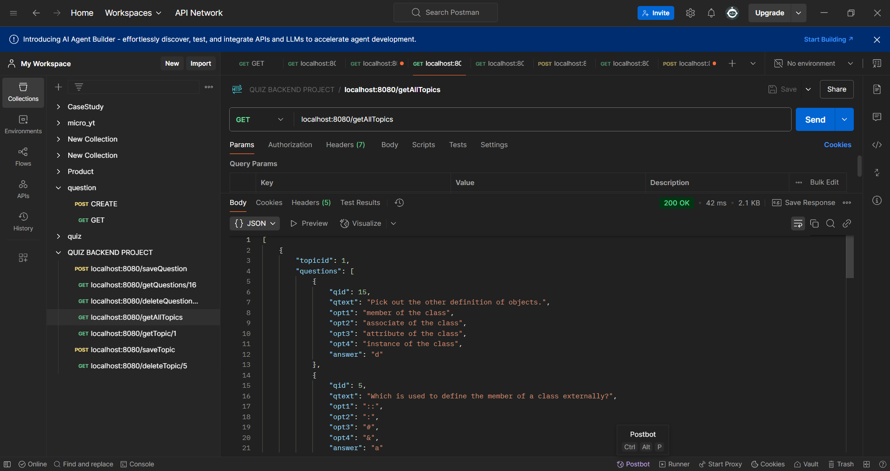
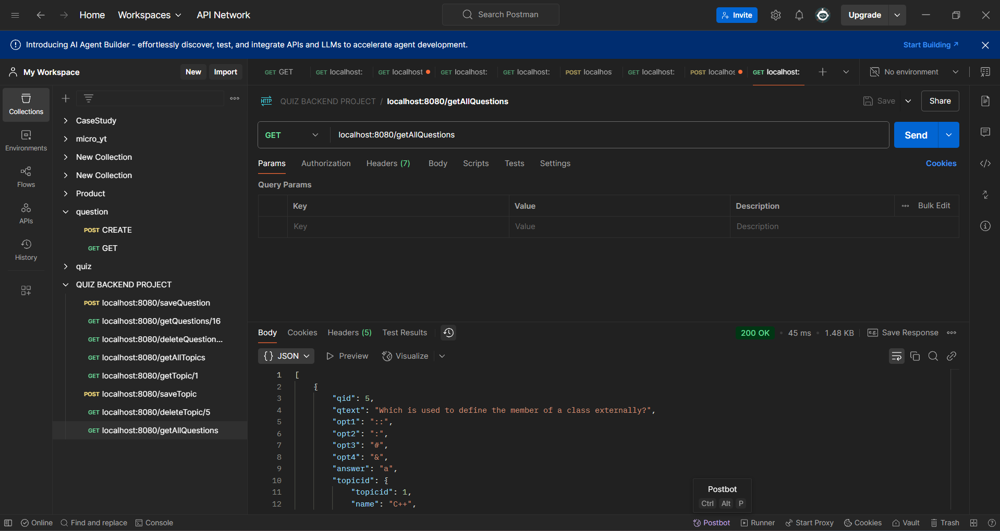
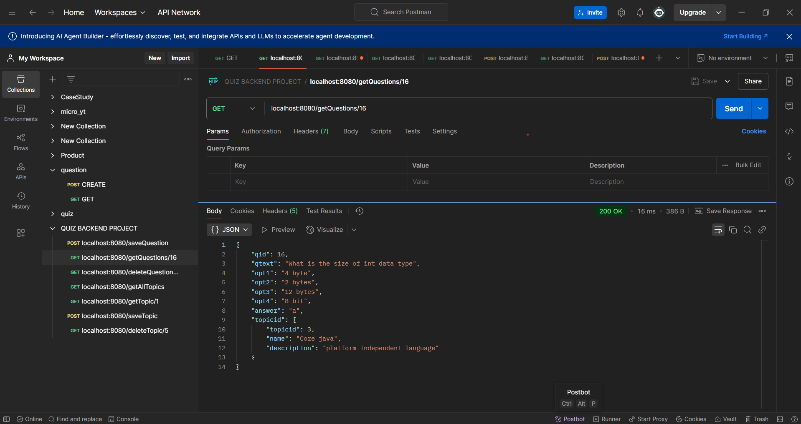
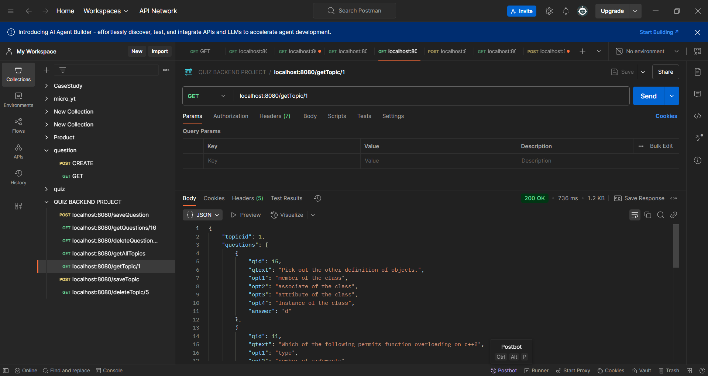
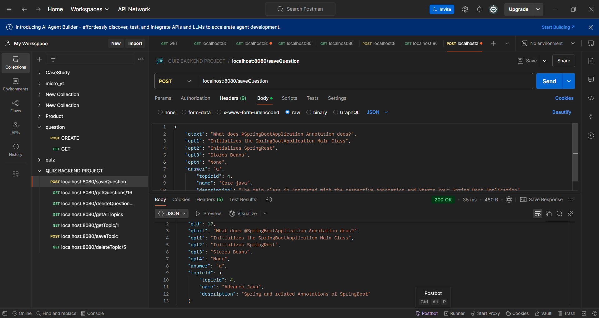
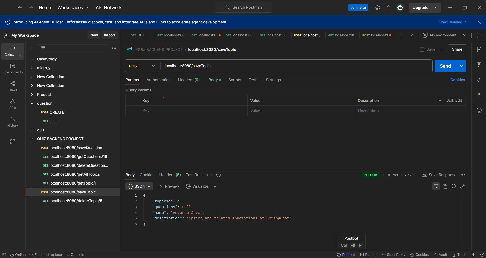
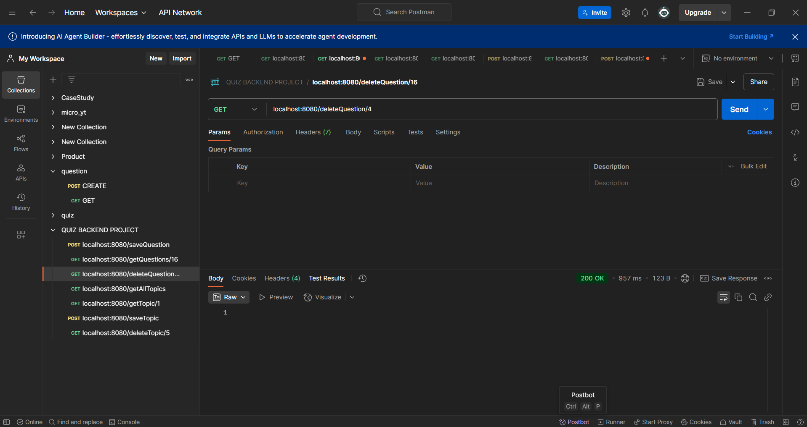
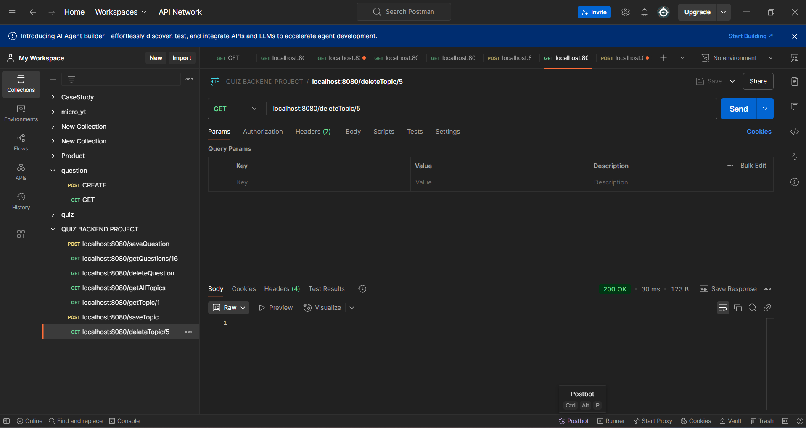

# Spring Boot REST API for Topics and Questions

This project is a Spring Boot-based REST API for managing topics and related questions. It allows users to create, retrieve, and delete topics and questions.

## Features
- CRUD operations for Topics
- CRUD operations for Questions
- RESTful API endpoints
- Uses JPA for database interaction
- Tested using POSTMAN

## Technologies Used
- Java
- Spring Boot
- Spring Data JPA
- Lombok
- PostgreSQL/MySQL (Configurable)

## Setup Instructions

### Prerequisites
- Java 17 or later
- Maven
- PostgreSQL/MySQL database
- POSTMAN for API testing (optional)

### Installation Steps
1. Clone the repository:
   ```bash
   git clone https://github.com/your-username/your-repo.git
   cd your-repo
   ```
2. Configure the database settings in `application.properties`.
3. Build the project using Maven:
   ```bash
   mvn clean install
   ```
4. Run the application:
   ```bash
   mvn spring-boot:run
   ```

## API Endpoints

### Topic Endpoints
- `GET /getAllTopics` - Fetch all topics
- `GET /getTopic/{topicid}` - Fetch a specific topic
- `POST /saveTopic` - Save a new topic
- `DELETE /deleteTopic/{topicid}` - Delete a topic

### Question Endpoints
- `GET /getAllQuestions` - Fetch all questions
- `GET /getQuestions/{qid}` - Fetch a specific question
- `POST /saveQuestion` - Save a new question
- `DELETE /deleteQuestion/{qid}` - Delete a question

## Postman Testing

### 1 . Get All Topics

### 2 . Get All Questions



### 3 . Get Question By ID


### 4 . Get Topic By ID


### 5 . Save Question


### 6 . Save Topic


### 7 . Delete Question By ID


### 8 . Delete QuestiTopicon By ID


## Contributing
Feel free to fork the repository and submit pull requests for improvements.

## License
This project is open-source and available under the [MIT License](LICENSE).

